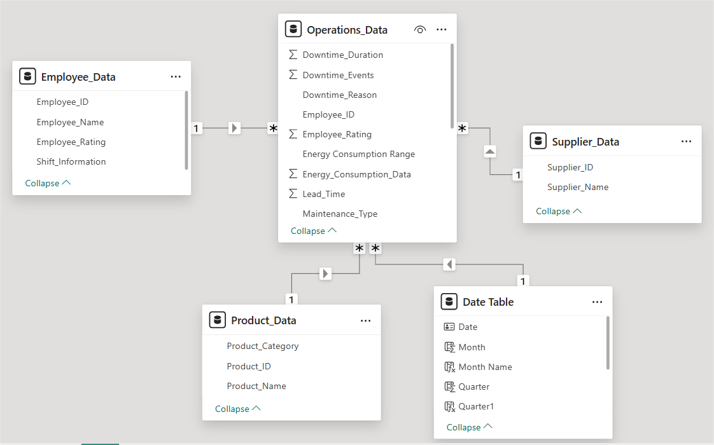
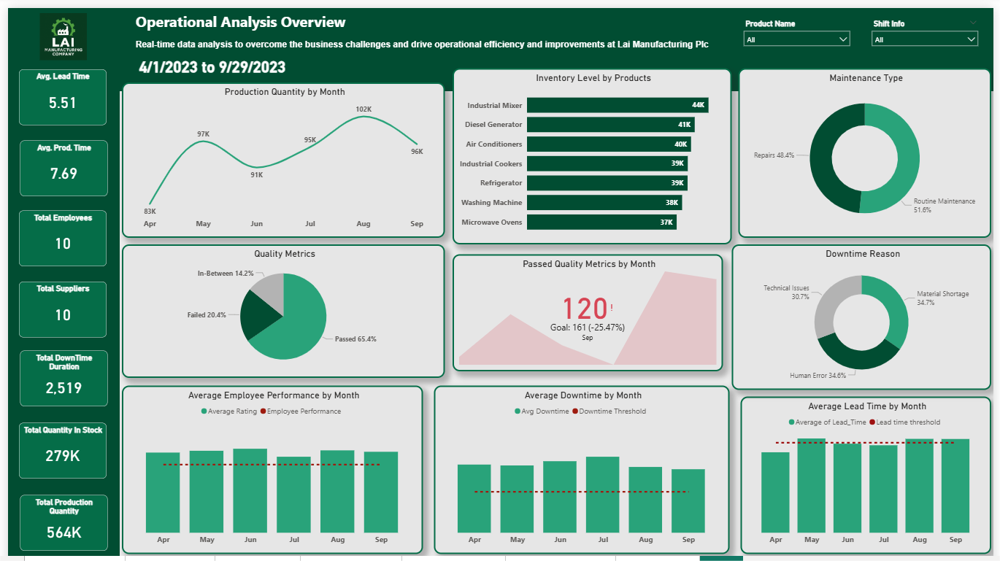
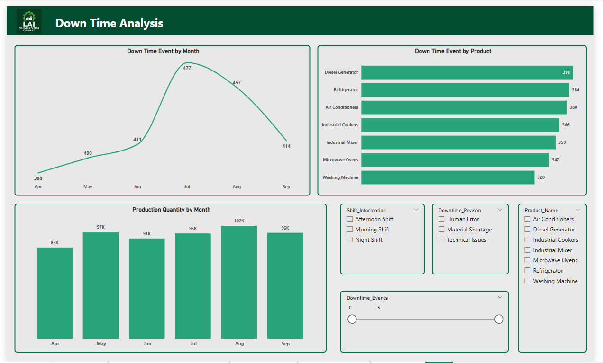
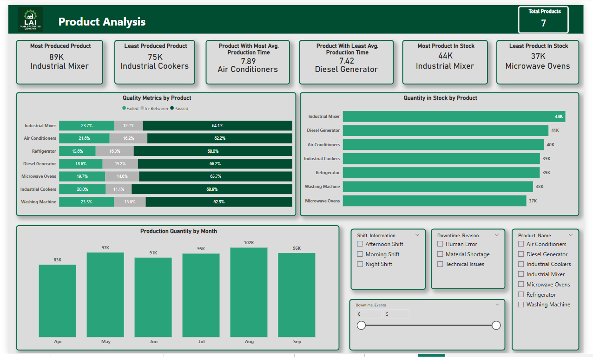
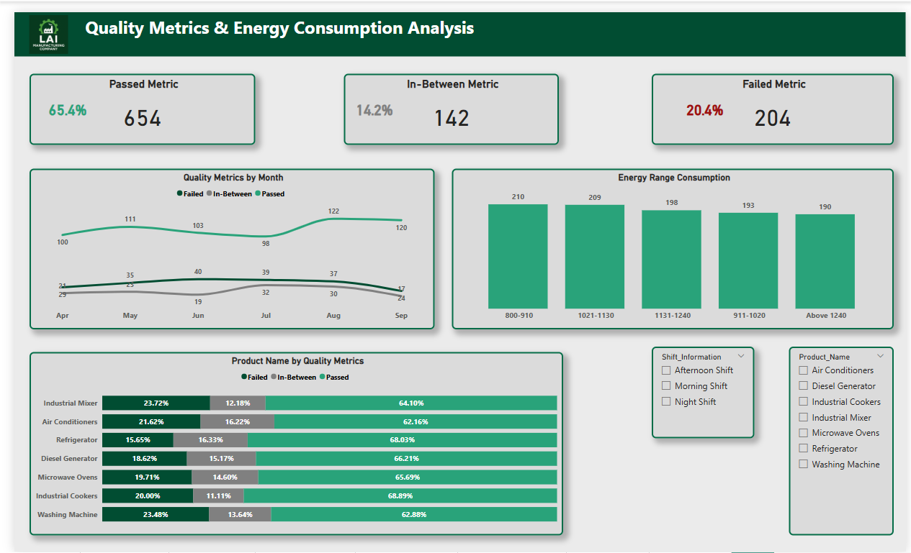
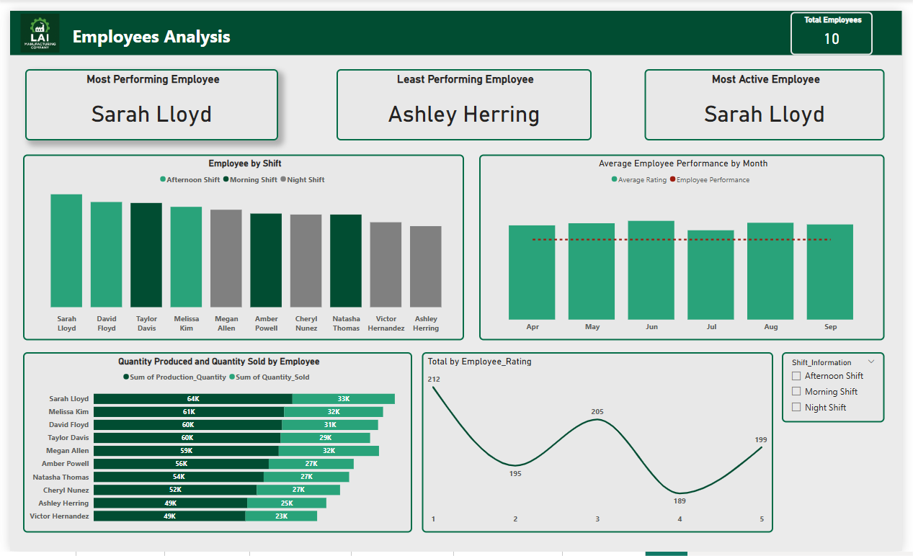
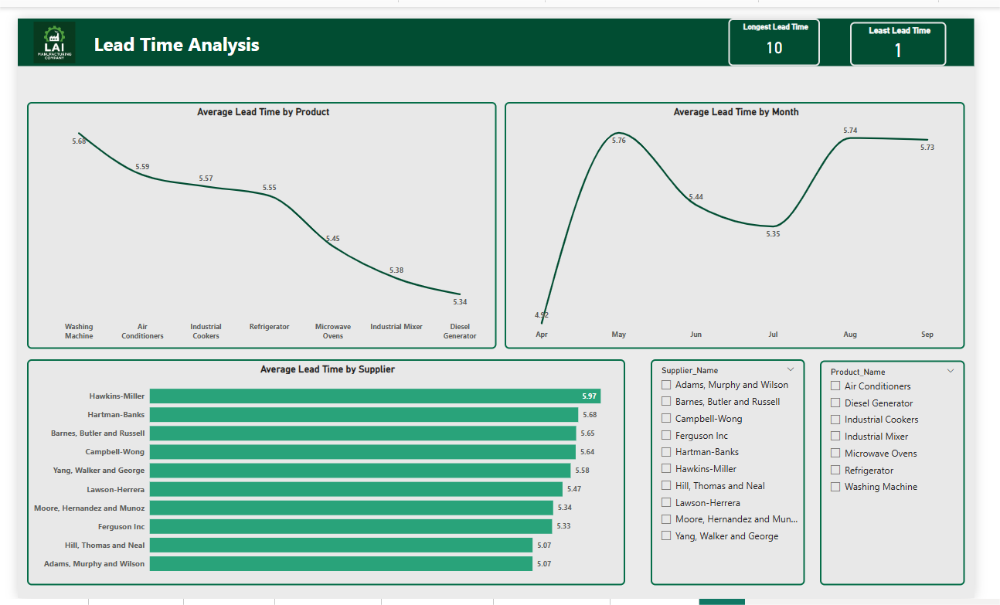

# Lai Manufacturing Plc - Operational Efficiency Analysis

## Background and Overview

Lai Manufacturing Plc is a global manufacturing company specializing in industrial machinery and home appliances production. The company faces critical operational challenges including production downtime, process inefficiencies, and inadequate reporting systems that hinder data-driven decision making. This project leverages operational analytics to transform raw manufacturing data into actionable insights for improved efficiency and cost optimization.

## Project Objectives:

- Process optimization through data-driven bottleneck identification
- Real-time dashboard development for operational visibility
- Quality metrics analysis and improvement recommendations
- Supply chain and maintenance optimization strategies

[View Interactive Dashboards and DAX Calculated](Lai_Manufacturing_Company_Analysis/Lai_Manufacturing_Company_Analysis.pbix) 

## Data Structure Overview

#### Data Architecture:
- **Original Dataset:** Single table containing all customer, booking, competitor, and channel data
- **ETL Transformation:** Normalized into 4 relational tables with appropriate keys
- **Final Structure:** Star schema design optimized for analytical queries

The analysis utilizes a comprehensive manufacturing dataset with 1,000 operational records spanning April-September 2023. The data architecture consists of four normalized tables:

### Operations_Data

|Column Name   |Description|
|--------------|------------|
|Operations_ID |A unique identifier for each operation or record in the dataset|
|Product_ID    | Foreign key linking to Product_Data table|
|Supplier_ID   |Foreign key linking to Supplier_Data table|
|Employee_ID   |Foreign key linking to Employee_Data table
|Production_Date|The date on which the operation or production occurred|
|Production_Quantity|The quantity of the product produced during the operation|
|Quality_Metrics|Assessment of product quality - "Passed," "Failed," or "In Between" standards|
|Quantity_in_Stock|The quantity of the product available in stock after the operation|
|Quantity_Sold|The quantity of the product that has been sold after the operation|
|Maintenance_Type|Type of maintenance carried out - "Routine Maintenance" or "Repairs"|
|Downtime_Duration|Duration of downtime experienced during the operation (non-productive time)|
|Energy_Consumption_Data|Data representing the energy consumed during the operation|
|Production_Time|The time it took to complete the operation or production|
|Downtime_Events|The number of downtime events that occurred during the operationDowntime_ReasonReason for downtime - "Material Shortage," "Technical Issues," or "Human Error"|

### Product_Data
|Column Name|Description|
|-----------|-----------|
|Product_ID|A unique identifier for each product in the dataset|
|Product_Name|The name of the product associated with the operation|
|Product_Category|The category to which the product belongs (Home Appliances or Industrial Machinery)|

### Employee_Data
|Column Name|Description|
|-----------|-----------|
|Employee_ID|A unique identifier for the employee involved in the operation|
|Employee_Name|The name of the employee responsible for the operation|
|Shift_Information|The shift during which operations occurred - "Morning," "Afternoon," "Evening," or "Night Shift"|
|Employee_Rating|Performance assessment of the employee on a scale from 1 to 5|

### Supplier_Data
|Column Name|Description|
|-----------|-----------|
|Supplier_ID|A unique identifier for the supplier associated with the operation|
|Supplier_Name|The name of the supplier that provided materials or components for production|
|Lead_Time|The time it takes for the supplier to deliver materials or components to support operations|

### Tools Used 
Power BI, DAX calculations, ETL processes, normalized data modeling Analysis Period: April 2023 - September 2023

### Key Metrics Tracked:

- Production volumes and quality metrics across 7 product lines
- Employee performance across 4 shifts with 10 total employees
- Supplier lead times from 10 vendors
- Downtime events and maintenance schedules
- Energy consumption and operational costs

## Executive Summary

### Overview of Findings

Manufacturing operations analysis reveals significant optimization opportunities across production, quality control, and supply chain management. While overall production targets are being met with **564K** total units produced, critical inefficiencies exist in quality control **(20.4% failure rate)**, inventory management (production significantly exceeds sales), and downtime management **(2,519 total downtime hours)**.

### Key Performance Indicators:

- **Production Efficiency:** **564K units** produced vs. **279K units** in stock
- **Quality Performance:** **65.4%** pass rate, **20.4%** failure rate requiring immediate attention
- **Supply Chain:** Average **5.51-day** lead time with significant supplier variability
- **Downtime Impact:** Peak downtime in July **(477 events)** indicating seasonal maintenance issues

### Insights Deep Dive

#### Production Performance Analysis
Production volumes peaked in August at 102K units but showed concerning quality trends. Industrial Mixers emerged as the most problematic product line, accounting for **23.7%** of all quality failures while also experiencing the longest production times **(7.89 average)**. This product requires immediate process review and quality control enhancement.

Monthly production patterns show consistent output except for a significant dip in July, coinciding with peak downtime events. The correlation between production volumes and quality failures suggests potential speed-quality trade-offs in manufacturing processes.

#### Quality Control Findings
Quality metrics reveal systemic issues requiring immediate attention. July experienced the worst quality performance with the highest failure rates across all product lines. 

##### Critical quality insights:

- **Industrial Mixers:** **23.7%** failure rate (highest)
- **Air Conditioners:** **21.6%** failure rate
- **Refrigerators:** **15.6%** failure rate (best performing)
The inverse relationship between production speed and quality suggests current processes may be optimized for volume at the expense of quality standards.

#### Employee Performance Analysis
**Sarah Lloyd** emerged as the top-performing employee, leading both production quantity **(64K units)** and maintaining high quality standards. However, significant performance gaps exist across the workforce, with **Victor Hernandez** showing the lowest productivity **(23K units).**

Employee ratings show concerning distribution with most staff performing below optimal levels **(average rating 2.8/5.0)**, indicating potential training and development needs across multiple shifts.

#### Supply Chain Optimization Opportunities
Lead time analysis reveals significant supplier performance variations. **Diesel Generator** suppliers show the shortest Avg. lead times **(5.34 days)** while **Industrial Mixer** suppliers have the longest **(5.97 days)**.**August** experienced peak lead times **(5.76 days average)**, correlating with production challenges.

Material shortage accounts for **34.7%** of downtime events, indicating critical supply chain coordination issues that directly impact production efficiency.

## Recommendations

### Quality Improvement Strategy

#### Immediate Actions:

- Implement enhanced quality control protocols for Industrial Mixer production line
- Conduct root cause analysis for July quality failures
- Establish real-time quality monitoring systems
- Develop quality-focused employee training programs

#### Process Optimization:

- Balance production speed targets with quality requirements
- Implement predictive quality analytics to prevent failures
- Create quality incentive programs linked to employee performance

### Supply Chain Enhancement

#### Supplier Management:

- Prioritize high-performing suppliers (shortest lead times) for critical components
- Implement supplier scorecards based on lead time and quality metrics
- Develop backup supplier relationships for materials prone to shortage
- Negotiate service level agreements with key suppliers to reduce material shortage downtime

### Employee Development

#### Performance Improvement:

- Implement comprehensive training programs focusing on underperforming employees
- Create mentorship programs pairing top performers with struggling employees
- Balance shift assignments to optimize overall productivity
- Develop performance-based incentive structures

### Maintenance Optimization

#### Downtime Reduction:

- Implement predictive maintenance systems to reduce unexpected breakdowns
- Optimize maintenance scheduling to minimize production impact
- Focus maintenance efforts on high-downtime products (Diesel Generators, Industrial Mixers)
- Develop preventive maintenance protocols for peak production periods

### Inventory Management

#### Production-Sales Alignment:

- Investigate sales process bottlenecks causing inventory accumulation
- Implement demand forecasting to align production with market requirements
- Develop sales team performance metrics and improvement strategies
- Create inventory optimization models to reduce carrying costs

This analysis provides actionable insights for operational efficiency improvements. Implementation of these recommendations should be prioritized based on business impact and resource availability.

